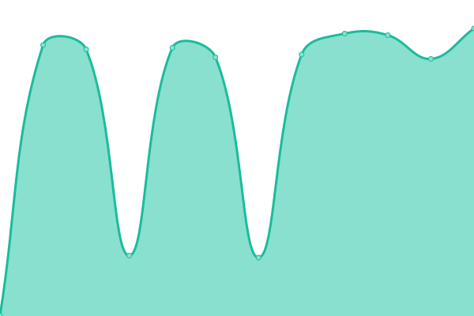

# [📈 Live Status](https://upptime.github.io/upptime): <!--live status--> **🟥 Complete outage**

This repository contains the open-source uptime monitor and status page for [Upptime](https://upptime.js.org), powered by [Upptime](https://github.com/upptime/upptime).

With [Upptime](https://upptime.js.org), you can get your own unlimited and free uptime monitor and status page, powered entirely by a GitHub repository. We use [Issues](https://github.com/upptime/upptime/issues) as incident reports, [Actions](https://github.com/StudioFM1/status/actions) as uptime monitors, and [Pages](https://upptime.github.io/upptime) for the status page.

<!--start: status pages-->
<!-- This summary is generated by Upptime (https://github.com/upptime/upptime) -->
<!-- Do not edit this manually, your changes will be overwritten -->
<!-- prettier-ignore -->
| URL | Status | History | Response Time | Uptime |
| --- | ------ | ------- | ------------- | ------ |
|  [Website](https://fm1.hmu.gr) | 🟥 Down | [website.yml](https://github.com/StudioFM1/status/commits/HEAD/history/website.yml) | 

 2026ms
     
 | 

<a href="https://StudioFM1.github.io/status/history/website">74.21%</a>
    

|  [Icecast](https://fm1.hmu.gr/) | 🟥 Down | [icecast.yml](https://github.com/StudioFM1/status/commits/HEAD/history/icecast.yml) | 

 511ms
     
 | 

<a href="https://StudioFM1.github.io/status/history/icecast">74.26%</a>
    

|  [Live Stream](https://fm1.hmu.gr/live.m3u) | 🟥 Down | [live-stream.yml](https://github.com/StudioFM1/status/commits/HEAD/history/live-stream.yml) | 

 301ms
     
 | 

<a href="https://StudioFM1.github.io/status/history/live-stream">74.27%</a>
    

<!--end: status pages-->

[**Visit our status website →**](https://upptime.github.io/upptime)

## 📄 License

- Powered by: [Upptime](https://github.com/upptime/upptime)
- Code: [MIT](./LICENSE) © [Anand Chowdhary](https://anandchowdhary.com), supported by [Pabio](https://pabio.com)
- Data in the `./history` directory: [Open Database License](https://opendatacommons.org/licenses/odbl/1-0/)
